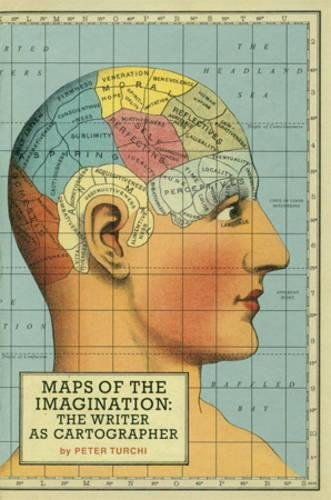

# Maps of the Codebase

_Inspired on Alvaro Videla ([@old_sound](https://twitter.com/old_sound)) essays and talks where he brings ideas from the literature world into that of software._

In the book [Maps of the Imagination: the Writer as Cartographer](https://www.amazon.com/Maps-Imagination-Writer-as-Cartographer/dp/1595340416) Peter Turchi draws parallelism between maps and the work of a cartographer to that of a writer.

Maps are a representation of our world, one that can never be fully accurate as if someone wanted to achieve that they would have to make a 1:1 copy of what they try to map.

...